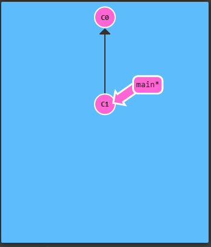
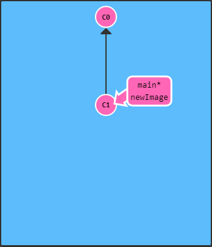

# **Ramas en Git**
 Las ramas en Git son solo referencias a un commit específico, como no hay consumo extra de almacenamiento ni memoria, es mas fácil dividir tu trabajo.
 **Recuerda que una rama dice:**
 "Quiero incluír el trabajo de este commit y todos sus ancestros."

 Vamos a crear una rama nueva:

 
  ## *git branch newImage*
  

  Para escoger la nueva rama necesitamos que el asterisco(*) se encuentre al lado del nombre de dicha rama:
  ## *git checkout newImage*
  

  Una vez que nos encontramos en la rama que queremos, vamos capturar una instantanea de los cambios preparados en ese momento del proyecto:
## *git commit*
  
