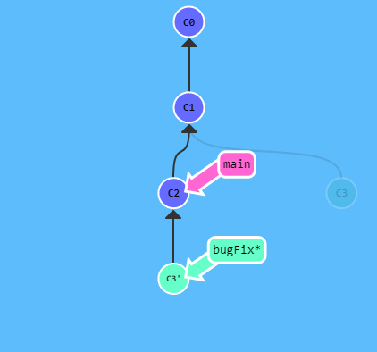
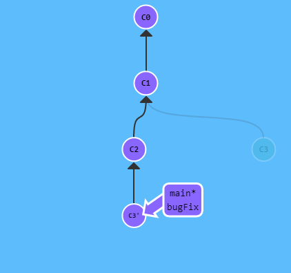

## Introducción a rebase

El segundo modo de combinar el trabajo de distintas ramas es el rebase. Hacer rebase escencialmente selecciona un conjunto de commits, los "copia", y los aplica en algún otro lado.

La ventaja de hacer rebase es que puede usarse para conseguir una secuencia de commits lineal, más bonita. El historial / log de commits del repositorio va a estar mucho más claro si sólo usas rebase.

# Demostración de Git

Aquí tenemos dos ramas otra vez. Observa que la rama bugFix está actualmente seleccionada (tiene un asterisco).

Nos gustaría mover nuestro trabajo de bugFix directamente sobre el trabajo de main. De ese modo, parecería que esas dos tareas se desarrollaron secuencialmente, cuando en realidad se hicieron en paralelo.

Hagámoslo usando el comando git rebase.

Ahora el trabajo de nuestra rama bugFix está justo encima del de main, y tenemos una secuencia lineal de commits.

Nota que el commit C3 sigue existiendo en algún lado (aparece medio desvanecido en el árbol), y C3' es la "copia" que rebaseamos sobre main.

El único problema es que main todavía no se actualizó, resolvámoslo ahora...

Ahora estamos parados sobre la rama main. Avancemos y hagamos rebase sobre bugFix...

Como main era un ancestro de bugFix, git simplemente movió la referencia de main hacia adelante en la historia.

