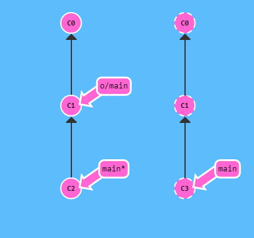

## Git Pull

Veamos primero un fetch y un merge ejecutados secuencialmente.

Descargamos C3 con un fetch y luego lo mergeamos con git merge o/main. Ahora nuestra rama main refleja el nuevo trabajo del remoto (en este caso, llamado origin).

¿Qué pasaría si en cambio utilizásemos git pull?
¡Lo mismo! Eso debería dejar bien claro que git pull es básicamente un atajo para hacer git fetch seguido por un merge con la rama que hayamos descargado.