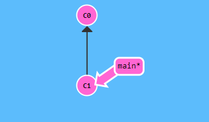
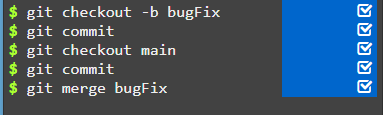
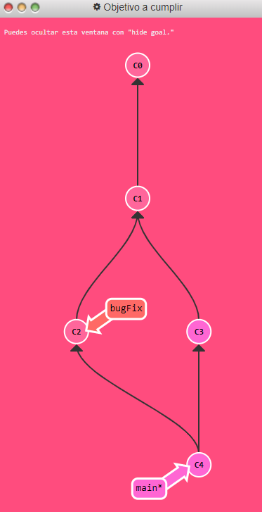

#Merge en ramas
1. El comando 'git merge' nos va a servir para unificar el trabajo de dos ramas diferentes. Esto nos va a permitir abrir una nueva rama de desarrollo, implementar alguna nueva funcionalidad y después unirla con el trabajo principal.
2. Hacer merge en Git crea un commit especial que tiene dos padres diferentes.
3. Esto significa que main ahora contiene todo el trabajo que hay en el repositorio.
4.Hacemos merge de main a bugFix. Como bugFix era un ancestro de main simplemente movió bugFix al mismo commit que main.

#Solución.

Antes del merge: 

Después del merge:

