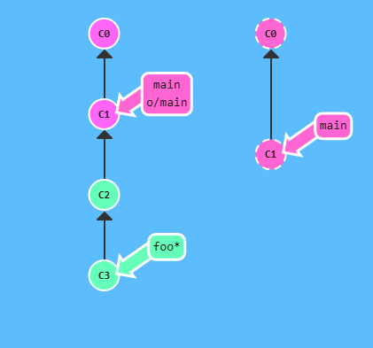
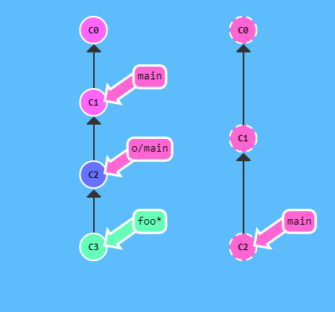
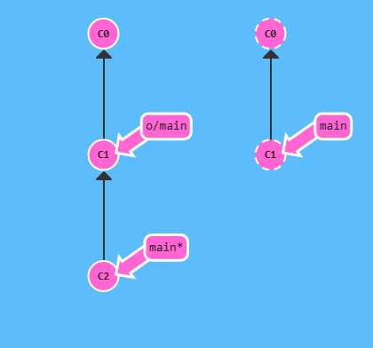
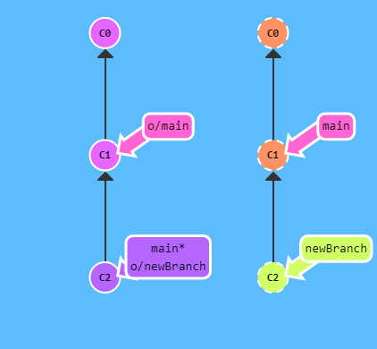

## Más parámetros de push

Para especificar tanto el origen como el destino de <lugar>, simplemente únelos usando el signo dos puntos:

git push origin <origen>:<destino>

A esto se le suele llamar refspec con dos puntos. Refspec es simplemente un nombre genial para una ubicación que git puede entender (como la rama foo, o incluso HEAD~1)

Una vez que especificas tanto el origen como el destino independientemente, puedes ponerte bastante cómodo y preciso con los comandos remotos.

Recuerda: origen es cualquier ubicación que git pueda entender:

git push origin foo:main

Ese commando es bastante rompedor, pero tiene sentido: git resolvió foo^ a una ubicación, subió cualquier commit de ahí que aún no estuviera en el remoto, y luego actualizó el destino.

¿Y qué ocurre si el destino al que quieres hacer push no existe? ¡Sin problema! Simplemente dale un nombre a la rama y git se va a encargar de creártelo en el remoto.

git push origin main:newBranch

